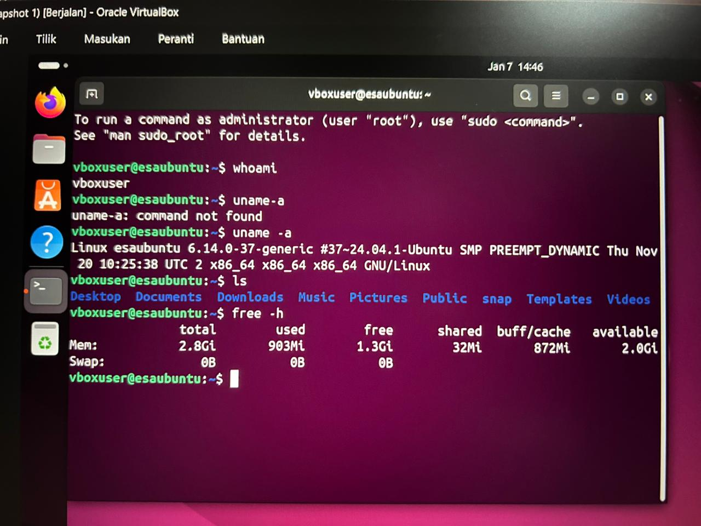
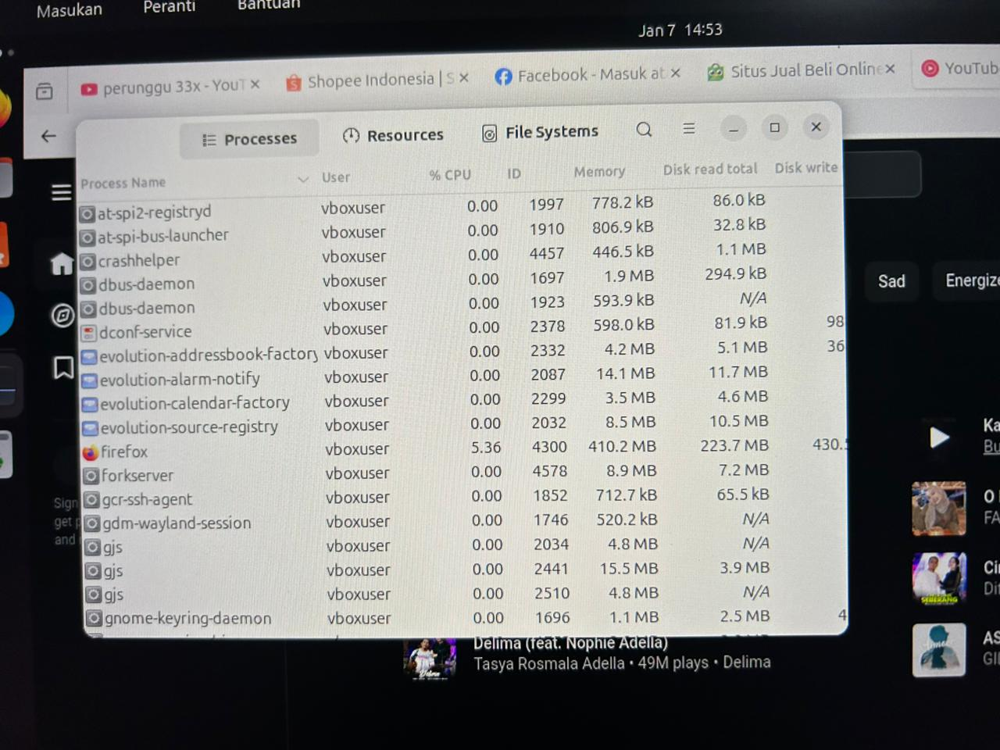
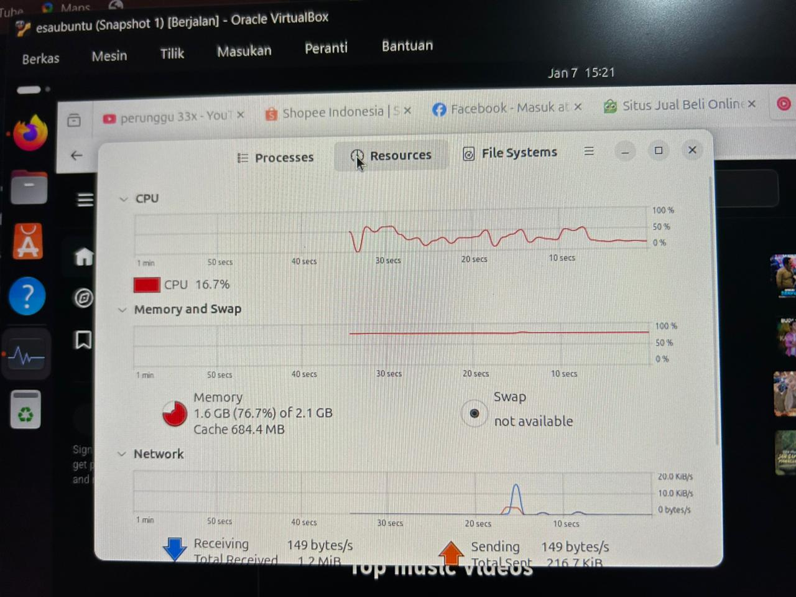

# Laporan Praktikum Minggu [12]
Topik: Virtualisasi Menggunakan Virtual Machine  
---

## Identitas
- **Nama**  : ikhsan mu'arif   
- **NIM**   : 250202921
- **Kelas** : 1IKRB

---

## Tujuan
Setelah menyelesaikan tugas ini, mahasiswa mampu:
1. Menginstal perangkat lunak virtualisasi (VirtualBox/VMware).  
2. Membuat dan menjalankan sistem operasi guest di dalam VM.  
3. Mengatur konfigurasi resource VM (CPU, RAM, storage).  
4. Menjelaskan mekanisme proteksi OS melalui virtualisasi.  
5. Menyusun laporan praktikum instalasi dan konfigurasi VM secara sistematis.

---

## Dasar Teori
Virtual Box Adalah perangkat lunak virtualisasi (hypervisor) sumber terbuka dari Oracle yang memungkinkan kita menjalankan guest OS di dalam sistem operasi host utama. Dengan VirtualBox, satu komputer fisik dapat menjalankan beberapa OS sekaligus. Contohnya menjalankan Linux di dalam Windows tanpa melakukan penginstalan dual-boot. 

---

## Langkah Praktikum
A. Persiapan & Instalasi

- Mengunduh file ISO Ubuntu 24.04 Desktop dan aplikasi Oracle VirtualBox.
- Ubuntu 24.04 Desktop : https://ubuntu.com/download/desktop
- Oracle VirtualBox : https://download.virtualbox.org/virtualbox/7.2.4/VirtualBox-7.2.4-170995-Win.exe
Menginstal VirtualBox pada Dekstop (Host OS).

B. Konfigurasi Awal (High Resource)
1. Membuat Virtual Machine baru dengan nama Linux-Ubuntu.
2. Mengatur spesifikasi awal VM:
- RAM: 3096 MB (3 GB).
- CPU: 3 Core.
3. Menjalankan VM dan menunggu proses instalasi Ubuntu selesai hingga masuk ke desktop.

C. Eksperimen VM Linux Ubuntu 24.04 LTS

- Setelah Konfigurasi selesai, klik open untuk membuka Virtual Machine
Membuka Terminal dan menjalankan perintah dasar untuk mengecek spesifikasi sistem.
- Membuka aplikasi Firefox dan memutar video YouTube serta membuka 5 tab sekaligus untuk memberikan beban kerja (stress test).
- Membuka System Monitor untuk memantau grafik penggunaan RAM dan CPU saat beban tinggi.

D. Eksperimen VM Mengurangi Resource
1. Mematikan VM (Shutdown).
2. Masuk ke menu Settings > System di VirtualBox.
3. Menurunkan alokasi resource menjadi:
- RAM: 2048 MB (2 GB).
- CPU: 1 Core.
4. Menyalakan kembali VM dan mengulangi pengujian dengan membuka Firefox.
5. Mengamati terjadinya penurunan performa (lag) dan peningkatan penggunaan memori hingga mendekati batas maksimal.

---

## Kode / Perintah
Tuliskan potongan kode atau perintah utama:
- whoami untuk Mengecek user yang sedang aktif
- uname -a untuk Menampilkan informasi detail kernel dan arsitektur sistem
- ls untuk Menampilkan daftar file di direktori saat ini
- free -h Mengecek penggunaan Memori (RAM) 

---

## Hasil Eksekusi
### 1. konfigurasi dan instalasi VM

### 2. Eksperimen VM Linux Ubuntu 24.04 LTS
Mengecek spesifikasi dengan perintah uname -a dan free -h (mengecek penggunaan ram ).

### 4.Pengujian beban kerja dengan membuka 5 tab Firefox (YouTube dan aplikasi belanja).

### 5. Stress Test (Skenario Low Resource : RAM 2 GB)
Setelah proses mengurangi Resource , kemudian membuka lagi VM dan membuka system manager, terlihat belum menjalankan aplikasi lain sudah memakan RAM 1.6 GB ( 76.7% ).

### SKENARIO PENGUJIAN RESOURCE
-----------------------------------------------------
Skenario 1: Konfigurasi Normal (High Performance)
- Base Memory (RAM) : 3096 MB (3 GB)
- Processor (CPU)   : 3 Core
- Base Disk Memory  : 25 GB
- Video Memory      : 128 MB
- Hasil Test        : Lancar membuka 5 tab Firefox.

Skenario 2: Konfigurasi Rendah (Low Performance)
- Base Memory (RAM) : 2048 MB (2 GB)
- Processor (CPU)   : 1 Core
- Base Disk Memory  : 25 GB
- Hasil Test        : Terjadi lag signifikan, Firefox lambat merespons.

---

## Analisis
1. Analisis Manajemen Memori (Memory Management)
   Berdasarkan pengujian menggunakan Firefox dengan lima tab aktif (pemutaran video YouTube dan web browsing), terlihat perbedaan yang signifikan dalam pengelolaan memori. Pada konfigurasi RAM 3 GB (±3096 MB), System Monitor menunjukkan penggunaan memori mencapai sekitar 92,2% atau ±2,5 GB. Meskipun persentase ini tergolong tinggi, sistem tetap berjalan dengan lancar.

   Sebaliknya, pada skenario pembanding dengan RAM 2 GB, sistem mengalami bottleneck. Ketika RAM fisik penuh, kernel Linux memindahkan sebagian data aplikasi yang jarang digunakan ke swap space yang berada di media penyimpanan. Karena kecepatan akses disk jauh lebih lambat dibandingkan RAM, proses ini menyebabkan penurunan performa sistem, seperti lag atau respons yang lambat. 

2. Analisis Prosesor dan Penjadwalan (Processor & Scheduling)

   Penggunaan konfigurasi dua core CPU memberikan pengaruh positif terhadap kemampuan multitasking sistem. Firefox sebagai aplikasi modern menggunakan arsitektur multi-process, sehingga pemanfaatan dua core memungkinkan pembagian beban kerja secara paralel. Proses pemrosesan video dapat berjalan pada satu core, sementara proses sistem dan aplikasi latar belakang ditangani oleh core lainnya.

   Jika dibandingkan dengan konfigurasi satu core, sistem dengan dua core memiliki overhead context switching yang lebih rendah. Pada satu core, CPU harus berpindah tugas secara terus-menerus antara proses aplikasi dan kernel, yang dapat menyebabkan latensi input, seperti gerakan mouse yang tidak responsif saat beban kerja tinggi. Dengan dua core, perpindahan konteks menjadi lebih efisien sehingga pengalaman pengguna terasa lebih stabil.

---

## Kesimpulan
1. Pengaruh RAM terhadap Performa
Pada alokasi 3 GB RAM, Ubuntu tetap berjalan stabil meskipun tingkat pemakaian memori melebihi 90% saat multitasking. ketika kapasitas diturunkan menjadi 2 GB, sistem mengalami keterbatasan memori yang menyebabkan penurunan kinerja. Aplikasi Firefox membutuhkan waktu lama untuk dibuka dan sering mengalami kondisi not responding akibat kekurangan RAM fisik.

2. Peran Hypervisor
VirtualBox terbukti mampu melakukan pembagian sumber daya prosesor secara efektif. Saat dialokasikan tiga core CPU, Ubuntu hanya mendeteksi jumlah tersebut, meskipun perangkat fisik memiliki core lebih banyak. ini menunjukkan bahwa mekanisme abstraksi hardware oleh hypervisor berjalan sesuai fungsi.

3. Isolasi Sistem
Beban kerja tinggi pada Guest OS berdampak pada penggunaan RAM di Host OS. Namun struktur dan file sistem antara Windows dan Ubuntu tetap terpisah sepenuhnya sehingga aktivitas di mesin virtual tidak mengganggu integritas sistem utam

## Quiz
1. Apa perbedaan antara host OS dan guest OS?  

   OS Host adalah sistem operasi utama yang berjalan langsung di perangkat keras fisik komputer, sementara Guest OS adalah sistem operasi yang berjalan di dalam Mesin Virtual (VM) yang dibuat oleh OS Host, sehingga Guest OS berinteraksi dengan perangkat keras melalui OS Host.
2. Apa peran hypervisor dalam virtualisasi?  

   Hypervisor berperan sebagai perantara antara perangkat keras fisik dan sistem operasi virtual. Fungsinya adalah mengelola, membagi, dan mengalokasikan sumber daya seperti CPU, RAM, serta storage agar dapat digunakan oleh beberapa Guest OS secara bersamaan. Selain itu, hypervisor memastikan setiap mesin virtual berjalan secara terisolasi sehingga tidak saling mengganggu dan tetap aman.
3. Mengapa virtualisasi meningkatkan keamanan sistem?  

   Virtualisasi memperkuat keamanan sistem karena setiap mesin virtual beroperasi di dalam ruang yang terpisah. Apabila ada masalah, kerusakan, atau serangan yang menimpa satu Guest OS, akibatnya tidak langsung berdampak pada Host OS atau mesin virtual lain yang ada.

---

## Refleksi Diri
Tuliskan secara singkat:
- Apa bagian yang paling menantang minggu ini?  
   laptop saya tidak kuat menggunakan virtual box
- Bagaimana cara Anda mengatasinya?  
   menggunakan laptop teman

---

**Credit:**  
_Template laporan praktikum Sistem Operasi (SO-202501) – Universitas Putra Bangsa_
