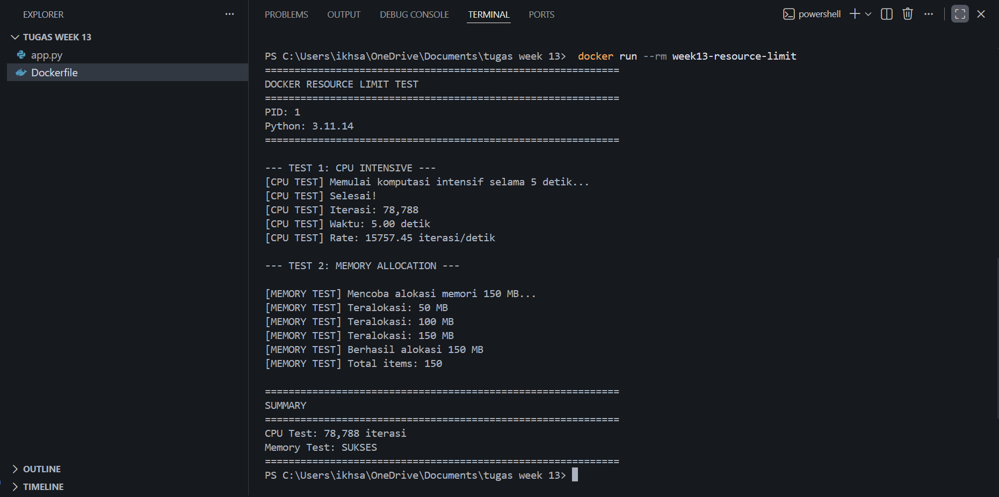
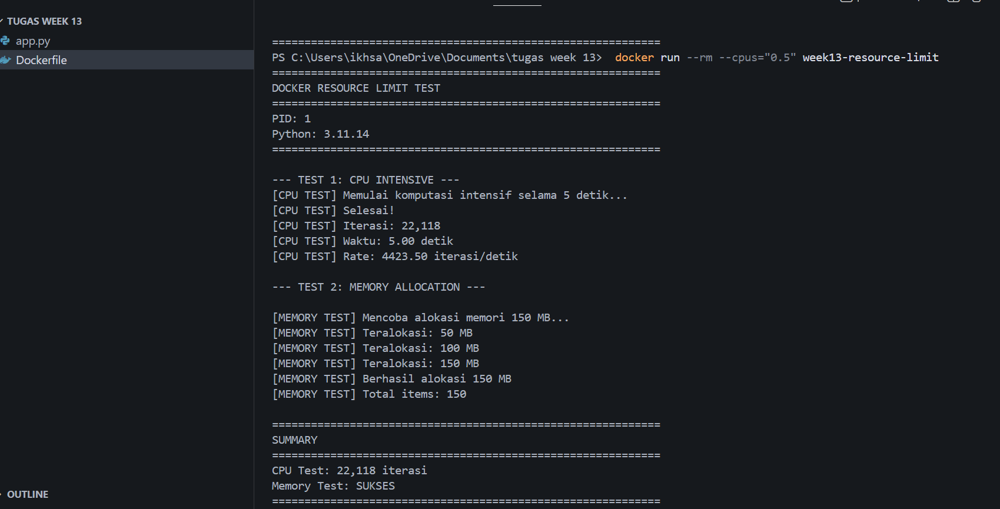
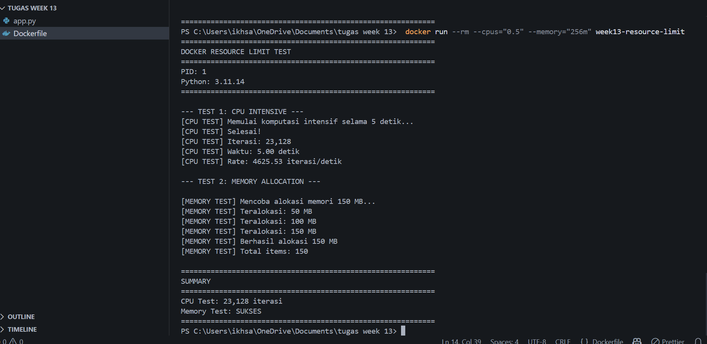

# Laporan Praktikum Minggu [13]
Topik: Docker – Resource Limit (CPU & Memori)

---

## Identitas
- **Nama**  : Ikhsan Mu'arif
- **NIM**   : 250202921
- **Kelas** : 1IKRB

---

## Tujuan
1. Menulis Dockerfile sederhana untuk sebuah aplikasi/skrip.
2. Membangun image dan menjalankan container.
3. Menjalankan container dengan pembatasan **CPU** dan **memori**.
4. Mengamati dan menjelaskan perbedaan eksekusi container dengan dan tanpa limit resource.
5. Menyusun laporan praktikum secara runtut dan sistematis.
---

## Dasar Teori
Docker adalah layanan yang menyediakan kemampuan untuk mengemas dan menjalankan sebuah aplikasi dalam sebuah lingkungan terisolasi yang disebut dengan container. Dengan adanya isolasi dan keamanan yang memadai memungkinkan kamu untuk menjalankan banyak container di waktu yang bersamaan pada host tertentu.

Dockerfile adalah sebuah file yang berisi instruksi dan perintah yang digunakan oleh Docker Engine untuk membuild atau membuat sebuah Image Docker.
---

## Langkah Praktikum
1. **Persiapan Lingkungan**

   - Pastikan Docker terpasang dan berjalan.
   - Verifikasi:
     ```bash
     docker version
     docker ps
     ```

2. **Membuat Aplikasi/Skrip Uji**

   Buat program sederhana di folder `code/` (bahasa bebas) yang:
   - Melakukan komputasi berulang (untuk mengamati limit CPU), dan/atau
   - Mengalokasikan memori bertahap (untuk mengamati limit memori).

3. **Membuat Dockerfile**

   - Tulis `Dockerfile` untuk menjalankan program uji.
   - Build image:
     ```bash
     docker build -t week13-resource-limit .
     ```

4. **Menjalankan Container Tanpa Limit**

   - Jalankan container normal:
     ```bash
     docker run --rm week13-resource-limit
     ```
   - Catat output/hasil pengamatan.

5. **Menjalankan Container Dengan Limit Resource**

   Jalankan container dengan batasan resource (contoh):
   ```bash
   docker run --rm --cpus="0.5" --memory="256m" week13-resource-limit
   ```
   Catat perubahan perilaku program (mis. lebih lambat, error saat memori tidak cukup, dll.).

6. **Monitoring Sederhana**

   - Jalankan container (tanpa `--rm` jika perlu) dan amati penggunaan resource:
     ```bash
     docker stats
     ```
   - Ambil screenshot output eksekusi dan/atau `docker stats`.


---

## Kode / Perintah
### 1. Isi file Docker
```bash

# Base image: Python slim untuk ukuran lebih kecil
FROM python:3.11-slim

# Set working directory
WORKDIR /app

# Copy aplikasi ke container
COPY app.py .

# Buat executable
RUN chmod +x app.py

# Label metadata
LABEL maintainer="student@example.com"
LABEL description="Docker Resource Limit Test Application"
LABEL version="1.0"

# Command untuk menjalankan aplikasi
CMD ["python3", "app.py"]
```
### 2. isi file python (app.py)
```python
"""
Program uji untuk mengamati dampak resource limit (CPU & Memory)
pada Docker container
"""

import time
import sys
import os

def cpu_intensive_task(duration=5):
    """Tugas komputasi intensif untuk menguji limit CPU"""
    print(f"[CPU TEST] Memulai komputasi intensif selama {duration} detik...")
    start_time = time.time()
    counter = 0
    
    while time.time() - start_time < duration:
        # Operasi matematika berulang
        result = sum([i**2 for i in range(1000)])
        counter += 1
    
    elapsed = time.time() - start_time
    print(f"[CPU TEST] Selesai!")
    print(f"[CPU TEST] Iterasi: {counter:,}")
    print(f"[CPU TEST] Waktu: {elapsed:.2f} detik")
    print(f"[CPU TEST] Rate: {counter/elapsed:.2f} iterasi/detik")
    return counter

def memory_intensive_task(size_mb=100):
    """Tugas alokasi memori untuk menguji limit memory"""
    print(f"\n[MEMORY TEST] Mencoba alokasi memori {size_mb} MB...")
    try:
        # Alokasi memori bertahap
        data = []
        chunk_size = 1024 * 1024  # 1 MB
        
        for i in range(size_mb):
            # Alokasi 1 MB data
            chunk = bytearray(chunk_size)
            data.append(chunk)
            
            if (i + 1) % 50 == 0:
                print(f"[MEMORY TEST] Teralokasi: {i + 1} MB")
        
        print(f"[MEMORY TEST] Berhasil alokasi {size_mb} MB")
        print(f"[MEMORY TEST] Total items: {len(data)}")
        
        # Tahan memori sebentar
        time.sleep(2)
        
        return True
    except MemoryError:
        print(f"[MEMORY TEST] GAGAL! Memory Error saat alokasi")
        return False
    except Exception as e:
        print(f"[MEMORY TEST] ERROR: {e}")
        return False

def print_header():
    """Cetak header informasi"""
    print("=" * 60)
    print("DOCKER RESOURCE LIMIT TEST")
    print("=" * 60)
    print(f"PID: {os.getpid()}")
    print(f"Python: {sys.version.split()[0]}")
    print("=" * 60)

def main():
    print_header()
    
    # Test 1: CPU Intensive
    print("\n--- TEST 1: CPU INTENSIVE ---")
    iterations = cpu_intensive_task(duration=5)
    
    # Test 2: Memory Allocation
    print("\n--- TEST 2: MEMORY ALLOCATION ---")
    memory_success = memory_intensive_task(size_mb=150)
    
    # Summary
    print("\n" + "=" * 60)
    print("SUMMARY")
    print("=" * 60)
    print(f"CPU Test: {iterations:,} iterasi")
    print(f"Memory Test: {'SUKSES' if memory_success else 'GAGAL'}")
    print("=" * 60)

if __name__ == "__main__":
    main()
```
### 1. Command Docker
1. Command untuk proses Build Image
```
 docker build -t week13-resource-limit .
```
2. Command untuk menjalankan container tanpa resource limit.
```
 docker run --rm week13-resource-limit
 ```
3. Command untuk proses menjalankan container dengan cpu limit.
```
docker run --rm --cpus="0.5" week13-resource-limit
```
4. command untukproses menjalankan container dengan memory limit.
```
docker run --rm --memory="128m" week13-resource-limit
```
5. command untukproses menjalankan container dengan cpu dan memory limit.
```
docker run --rm --cpus="0.5" --memory="256m" week13-resource-limit
```
---

## Hasil Eksekusi
### Build docker image

### 1.container tanpa limit

### 2. Container dengan CPU Limit (0.5 CPU)

### 3. Container dengan Memory Limit

### 4. Container dengan CPU & Memory Limit

### Monitoring dengan docker stats
```bash
# Terminal 1: Jalankan container (tanpa --rm agar bisa dimonitor)
docker run --name test-resource --cpus="0.5" --memory="256m" week13-resource-limit

# Terminal 2: Monitor
docker stats test-resource
```

---

## Analisis
 Pada kondisi tanpa resource limit, container dapat memanfaatkan CPU dan memori host secara maksimal sehingga performa aplikasi berada pada kondisi optimal. Hal ini terlihat dari tingginya jumlah iterasi CPU dan keberhasilan alokasi memori tanpa hambatan.

Saat CPU dibatasi, performa komputasi menurun secara signifikan dan proporsional dengan nilai limit yang diberikan. Pembatasan CPU tidak memengaruhi penggunaan memori, sehingga aplikasi tetap mampu melakukan alokasi memori selama batas memori tidak dilanggar. Ini menunjukkan bahwa limit CPU dan memori bekerja secara independen.

Sebaliknya, pada pembatasan memori, aplikasi yang membutuhkan memori lebih besar dari limit yang ditetapkan mengalami kegagalan dan dihentikan oleh sistem melalui mekanisme OOM Killer. Meskipun performa CPU tetap normal, kekurangan memori menyebabkan aplikasi tidak dapat berjalan stabil. Hal ini menegaskan bahwa penetapan limit memori harus disesuaikan dengan kebutuhan aktual aplikasi.

Pada pengujian dengan kombinasi CPU dan memori limit, container berjalan stabil selama resource yang dialokasikan mencukupi. Monitoring menggunakan docker stats memperlihatkan bahwa Docker menerapkan isolasi resource secara efektif menggunakan cgroups, sehingga penggunaan resource dapat dikontrol dan dipantau dengan baik.

---

## Kesimpulan
Pembatasan sumber daya pada Docker terbukti berfungsi baik dalam mengatur pemakaian CPU dan memori kontainer melalui mekanisme cgroups di Linux. Isolasi sumber daya ini mencegah satu kontainer mengambil alih sumber daya host dan mengganggu kontainer lainnya. Penerapan batasan CPU memiliki dampak langsung dan sebanding terhadap performa aplikasi, di mana batasan hingga 0.5 CPU menyebabkan penurunan performa sekitar 50% tanpa memengaruhi alokasi memori. Di sisi lain, pembatasan memori yang tidak sesuai dengan kebutuhan aplikasi dapat menyebabkan sistem menghentikan kontainer (OOM kill). Oleh karena itu, aplikasi perlu disesuaikan dengan batas memori yang ditetapkan dan diberikan cukup ruang memori untuk menghindari penghentian mendadak.
---

## Quiz
1. Mengapa container perlu dibatasi CPU dan memori?
   Pembatasan CPU dan memori diperlukan untuk mencegah satu container menghabiskan seluruh resource, menjaga isolasi dan keamanan, memastikan stabilitas dan performa sistem, mengoptimalkan biaya infrastruktur, serta menjamin Quality of Service (QoS) bagi aplikasi.
2. Apa perbedaan VM dan container dalam konteks isolasi resource?
   Virtual Machine (VM) memiliki isolasi penuh di level hardware dengan OS sendiri sehingga lebih aman namun boros resource dan lambat. Container berbagi kernel host, lebih ringan, cepat, dan efisien, tetapi tingkat isolasinya lebih rendah. VM cocok untuk kebutuhan isolasi tinggi, sedangkan container cocok untuk aplikasi cloud-native dan microservices.
3. Apa dampak limit memori terhadap aplikasi yang boros memori?
   Limit memori dapat menyebabkan aplikasi dihentikan (OOM Kill), kegagalan alokasi memori, penurunan performa akibat GC berlebih, instabilitas aplikasi, hingga gangguan layanan. Dampak ini dapat dideteksi melalui monitoring resource, log sistem, dan testing, serta dimitigasi dengan optimasi aplikasi dan penyesuaian limit memori.

---

## Refleksi Diri
Tuliskan secara singkat:
- Apa bagian yang paling menantang minggu ini?  
Semuanya menantang
- Bagaimana cara Anda mengatasinya?  
sholat dan berusaha
---

**Credit:**  
_Template laporan praktikum Sistem Operasi (SO-202501) – Universitas Putra Bangsa_
