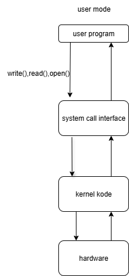
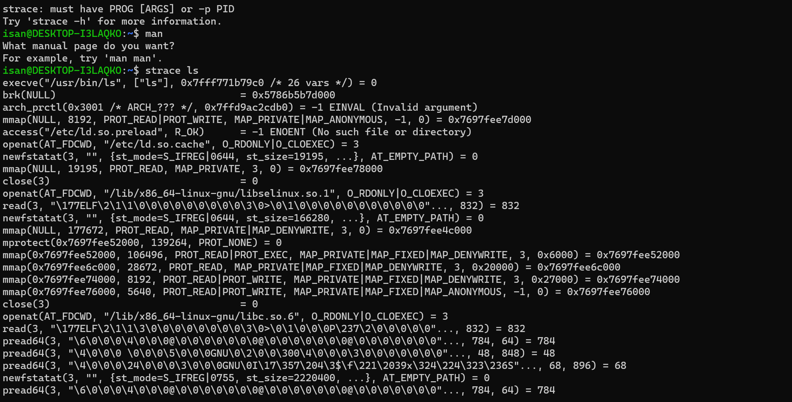
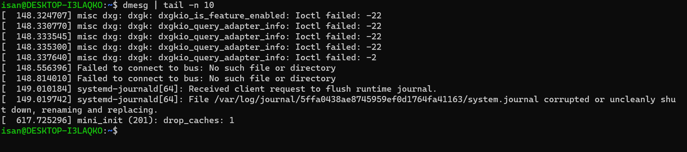

# Laporan Praktikum Minggu [2]
mekanisme system call dan struktur sistem operasi

---

## Identitas
- **Nama**  : Ikhsan Mu'arif 
- **NIM**   : 250202921
- **Kelas** : 1IKRB

---

## Tujuan
Tuliskan tujuan praktikum minggu ini.  
1. Menjelaskan konsep dan fungsi system call dalam sistem operasi.
2. Mengidentifikasi jenis-jenis system call dan fungsinya.
3. Mengamati alur perpindahan mode user ke kernel saat system call terjadi.
4. Menggunakan perintah Linux untuk menampilkan dan menganalisis system call.


---

## Dasar Teori
Pada praktikum minggu ini, mahasiswa akan mempelajari **mekanisme system call dan struktur sistem operasi**.  
System call adalah antarmuka antara program aplikasi dan kernel yang memungkinkan aplikasi berinteraksi dengan perangkat keras secara aman melalui layanan OS.

Mahasiswa akan melakukan eksplorasi terhadap:
- Jenis-jenis system call yang umum digunakan (file, process, device, communication).
- Alur eksekusi system call dari mode user menuju mode kernel.
- Cara melihat daftar system call yang aktif di sistem Linux.

---

## Langkah Praktikum
1. Setup Environment
Gunakan Linux (Ubuntu/WSL).
Pastikan perintah strace dan man sudah terinstal.
Konfigurasikan Git (jika belum dilakukan di minggu sebelumnya).
2. Eksperimen 1 – Analisis System Call Jalankan perintah berikut:
```bash
strace ls
```
Catat 5–10 system call pertama yang muncul dan jelaskan fungsinya.
Simpan hasil analisis ke results/syscall_ls.txt.

3. Eksperimen 2 – Menelusuri System Call File I/O Jalankan:
strace -e trace=open,read,write,close cat /etc/passwd
Analisis bagaimana file dibuka, dibaca, dan ditutup oleh kernel.

4. Eksperimen 3 – Mode User vs Kernel Jalankan:
```bash
dmesg | tail -n 10
```
Amati log kernel yang muncul. Apa bedanya output ini dengan output dari program biasa?

5. Diagram Alur System Call
Buat diagram yang menggambarkan alur eksekusi system call dari program user hingga kernel dan kembali lagi ke user mode.
Gunakan draw.io / mermaid.
Simpan di:
praktikum/week2-syscall-structure/screenshots/syscall-diagram.png

---

## Kode / Perintah
Tuliskan potongan kode atau perintah utama:
```bash
strace ls
strace -e trace=open,read,write,close cat /etc/passwd
dmesg | tail -n 10

```

---

## Hasil Eksekusi
Sertakan screenshot hasil percobaan atau diagram:



 

---

## Eksperimen 1 – Analisis System Call
| No | Perintah/System Call | Fungsi                   | Contoh Output              | Tujuan              |       |                    |
| -- | -------------------- | ------------------------ | -------------------------- | ------------------- | ----- | ------------------ |
| 1  | `fork`               | Membuat proses baru      | `fork()` → `12345`         | Duplikasi proses    |       |                    |

| 2 | `kill`               | Kirim sinyal ke proses   | `kill(12345, SIGTERM)`     | Hentikan proses     |       |                    |
| 3  | `clone`              | Buat proses/thread       | `clone(..., flags=CLONE_VM | CLONE_FS            | ...)` | Buat thread manual |
| 4 | `write`              | Tulis ke file/deskriptor | `write(1, "Hello\n", 6)`   | Kirim data keluar   |       |                    |
| 5  | `close`              | Tutup file descriptor    | `close(3)`                 | Lepas akses file    |       |                    |
| 6  | `getpid`             | Ambil ID proses          | `getpid()` → `54321`       | Lihat PID sendiri   |       |                    |

## Eksperimen 2 – Menelusuri System Call File I/O

   * Saat perintah cat /etc/passwd dijalankan, program meminta kernel untuk membuka file /etc/passwd.
   Kernel akan memeriksa apakah file tersebut ada dan apakah proses memiliki izin untuk membacanya.
   Jika berhasil, kernel memberikan file descriptor — sebuah angka unik yang mewakili file tersebut di dalam proses. File descriptor ini akan digunakan untuk operasi selanjutnya seperti membaca dan menulis.

   * Setelah file berhasil dibuka, program menggunakan file descriptor untuk membaca isi file.
   Melalui system call read, kernel menyalin data dari file (di disk) ke buffer dalam memori proses.

   * data yang sudah dibaca dari file kemudian ditulis ke layar (stdout) menggunakan system call write.
   Program menggunakan file descriptor 1 yang merupakan standar output (layar/terminal).

   * etelah semua data selesai dibaca dan ditampilkan, program menutup file menggunakan system call close.
## Eksperimen 3 – Mode User vs Kernel
   * Log kernel (dari dmesg) adalah pesan yang berasal dari bagian terdalam sistem operasi, yaitu kernel. Pesan ini muncul saat ada aktivitas penting di sistem, terutama yang berhubungan dengan perangkat keras atau driver.

---

## Analisis
- Jelaskan makna hasil percobaan. 
  Menunjukkan interaksi antara user space dan kernel space Menilai efisiensi OS dalam menangani tugas Menganalisis perilaku program
- Hubungkan hasil dengan teori (fungsi kernel, system call, arsitektur OS).  
  Hasil percobaan menunjukkan bagaimana program berbicara dengan kernel lewat system call.
System call ini adalah bagian penting dari OS karena jadi penghubung antara program dan hardware.
Efisiensi dan kecepatan system call bisa berbeda, tergantung bagaimana arsitektur kernel OS itu dirancang.
- Apa perbedaan hasil di lingkungan OS berbeda (Linux vs Windows)?  
 System call di Linux umumnya lebih cepat dan efisien dibandingkan Windows.
Hal ini karena Linux menggunakan monolithic kernel yang memungkinkan akses langsung ke layanan kernel tanpa banyak lapisan tambahan.

---
## Analisis 400–500 kata 
 1. Mengapa System Call Penting untuk Keamanan OS dan Bagaimana OS Menjaga Transisi User–Kernel yang Aman

System call adalah penghubung antara aplikasi yang berjalan di mode pengguna (user mode) dengan kernel sistem operasi yang berjalan di mode kernel (kernel mode). System call memungkinkan aplikasi meminta layanan sistem, seperti akses file, komunikasi jaringan, atau manajemen proses, secara terkontrol dan aman.
System call sangat penting dalam menjaga keamanan sistem operasi karena mereka menjadi satu-satunya cara bagi program untuk berinteraksi dengan sumber daya hardware dan kernel. Tanpa system call, aplikasi bisa langsung mengakses hardware atau memori kernel, yang akan sangat berbahaya. Dengan adanya system call, kernel dapat melakukan validasi dan kontrol terhadap setiap permintaan. Misalnya, ketika sebuah aplikasi ingin membuka file, kernel akan mengecek apakah aplikasi tersebut punya izin akses terhadap file tersebut. Jika tidak, kernel akan menolak permintaan tersebut. Hal ini mencegah program jahat mengakses data yang seharusnya dilindungi. Selain itu, system call juga merupakan titik implementasi berbagai mekanisme keamanan seperti pengaturan hak akses (access control), sandboxing, dan pelacakan aktivitas (audit). Contohnya, sistem keamanan seperti SELinux memanfaatkan kontrol system call untuk membatasi operasi yang bisa dilakukan oleh suatu program.

2. Bagaimana OS Memastikan Transisi User–Kernel Berjalan Aman?
Transisi dari mode pengguna ke mode kernel adalah proses yang sangat sensitif. Jika tidak dijaga dengan baik, bisa terjadi serangan yang memungkinkan program biasa mendapatkan akses kernel yang seharusnya tidak dimiliki. Untuk itu, OS dan CPU menggunakan beberapa mekanisme keamanan:

-Mode Privilege Terpisah
CPU mempunyai dua mode: user mode dan kernel mode. Program hanya bisa masuk ke kernel mode melalui instruksi khusus yang diizinkan, misalnya syscall di Linux. Ini memastikan aplikasi tidak bisa sembarangan menjalankan kode kernel.

-Validasi Parameter
Kernel selalu memeriksa setiap data atau pointer yang dikirim aplikasi lewat system call. Ini mencegah program memberikan alamat memori yang salah atau berbahaya.

-Isolasi Memori
Teknologi virtual memory dan MMU menjaga agar memori kernel tidak bisa diakses langsung oleh aplikasi biasa. Jadi, aplikasi tidak dapat merusak data kernel atau proses lain.

-Pengamanan Jalur Eksekusi
Beberapa OS juga menerapkan teknik seperti Control Flow Integrity (CFI) yang menjaga agar jalur eksekusi kode kernel tidak bisa dibajak oleh program jahat.

3. Contoh System Call yang Sering Digunakan di Linux
read() dan write(): Membaca dan menulis data ke file atau perangkat.
open() dan close(): Membuka dan menutup file.
fork(): Membuat proses baru.

System call sangat krusial dalam arsitektur sistem operasi karena mereka menjamin bahwa setiap akses ke sumber daya yang sensitif harus melalui jalur yang aman dan terkendali. Dengan mekanisme validasi dan isolasi yang ketat, OS memastikan transisi dari user mode ke kernel mode tidak bisa disalahgunakan, sehingga menjaga stabilitas dan keamanan sistem secara keseluruhan.

## Kesimpulan
Tuliskan 2–3 poin kesimpulan dari praktikum ini.
System call adalah mekanisme utama komunikasi antara program dan kernel, yang memungkinkan program mengakses layanan OS seperti file, memori, dan proses secara aman.

Hasil praktikum menunjukkan bahwa Linux lebih efisien dalam menangani system call dibanding Windows, karena arsitektur kernel Linux yang monolithic meminimalkan overhead.
Alat analisis seperti strace di Linux memudahkan pengamatan langsung terhadap system call, sedangkan di Windows, pemantauan memerlukan tool tambahan dan lebih kompleks.

---

## Quiz
1. Apa fungsi utama system call dalam sistem operasi?
   Fungsi utama system call dalam sistem operasi adalah sebagai penghubung (interface) antara program pengguna (user‑space) dan kernel (kernel‑space), agar program dapat meminta layanan dari sistem operasi secara aman dan terkontrol
2. Sebutkan 4 kategori system call yang umum digunakan.  
   manajemen proses(process control), Manajemen Berkas (File Management), Manajemen Perangkat (Device Management), Manajemen Informasi (Information Maintenance)
3. Mengapa system call tidak bisa dipanggil langsung oleh user program?
   sytem call tidak bisa dipanggil langsung oleh user program karena alasan utama yaitu keamanan, perlindungan sistem, abstraksi dan control, stabilitas sistem

---

## Refleksi Diri
Tuliskan secara singkat:
- Apa bagian yang paling menantang minggu ini? 
 wsl tidak bisa digunakan pak  
- Bagaimana cara Anda mengatasinya?  
 tutorial di youtube
---

**Credit:**  
_Template laporan praktikum Sistem Operasi (SO-202501) – Universitas Putra Bangsa_
