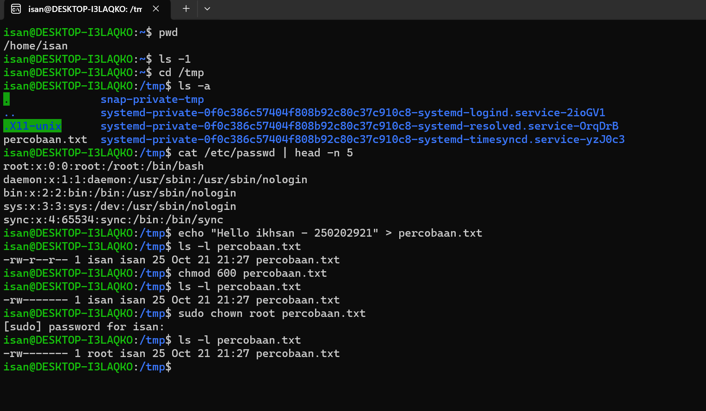

# Laporan Praktikum Minggu [3]
Topik: Manajemen File dan Permission di Linux  

---

## Identitas
- **Nama**  : Ikhsan Mu'arif
- **NIM**   : 250202921
- **Kelas** : 1IKRB

---

## Tujuan
Tuliskan tujuan praktikum minggu ini.  
Setelah menyelesaikan tugas ini, mahasiswa mampu:
1. Menggunakan perintah ls, pwd, cd, cat untuk navigasi file dan direktori.
2. Menggunakan chmod dan chown untuk manajemen hak akses file.
3. Menjelaskan hasil output dari perintah Linux dasar.
4. Menyusun laporan praktikum dengan struktur yang benar.
5. Mengunggah dokumentasi hasil ke Git Repository tepat waktu.
---

## Dasar Teori
Pada praktikum minggu ini, mahasiswa akan mempelajari pengelolaan file dan direktori menggunakan perintah dasar Linux, serta konsep permission dan ownership.
Praktikum berfokus pada:
1. Navigasi sistem file dengan ls, pwd, cd, dan cat.
2. Pengaturan hak akses file menggunakan chmod.
3. Pengubahan kepemilikan file menggunakan chown.
4. Dokumentasi hasil eksekusi dan pengelolaan repositori praktikum.
 Tujuan utama dari praktikum ini adalah agar mahasiswa mampu mengoperasikan perintah Linux dasar dengan benar, memahami sistem izin (permission), dan mendokumentasikan hasilnya dalam format laporan Git.


---

## Langkah Praktikum
1. **Setup Environment**
   - Gunakan Linux (Ubuntu/WSL).
   - Pastikan folder kerja berada di dalam direktori repositori Git praktikum:
     ```
     praktikum/week3-linux-fs-permission/
     ```

2. **Eksperimen 1 – Navigasi Sistem File**
   Jalankan perintah berikut:
   ```bash
   pwd
   ls -l
   cd /tmp
   ls -a
   ```
   - Jelaskan hasil tiap perintah.
   - Catat direktori aktif, isi folder, dan file tersembunyi (jika ada).

3. **Eksperimen 2 – Membaca File**
   Jalankan perintah:
   ```bash
   cat /etc/passwd | head -n 5
   ```
   - Jelaskan isi file dan struktur barisnya (user, UID, GID, home, shell).

4. **Eksperimen 3 – Permission & Ownership**
   Buat file baru:
   ```bash
   echo "Hello <NAME><NIM>" > percobaan.txt
   ls -l percobaan.txt
   chmod 600 percobaan.txt
   ls -l percobaan.txt
   ```
   - Analisis perbedaan sebelum dan sesudah chmod.  
   - Ubah pemilik file (jika memiliki izin sudo):
   ```bash
   sudo chown root percobaan.txt
   ls -l percobaan.txt
   ```
   - Catat hasilnya.

5. **Eksperimen 4 – Dokumentasi**
   - Ambil screenshot hasil terminal dan simpan di:
     ```
     praktikum/week3-linux-fs-permission/screenshots/
     ```
   - Tambahkan analisis hasil pada `laporan.md`.

6. **Commit & Push**
   ```bash
   git add .
   git commit -m "Minggu 3 - Linux File System & Permission"
   git push origin main
   ```

---

## Kode / Perintah
Tuliskan potongan kode atau perintah utama:
```bash
pwd
ls -l
cd /tmp
ls -a
cat /etc/passwd | head -n 5
echo "Hello <NAME><NIM>" > percobaan.txt
ls -l percobaan.txt
chmod 600 percobaan.txt
ls -l percobaan.txt
sudo chown root percobaan.txt
ls -l percobaan.txt

```

---

## Hasil Eksekusi
Sertakan screenshot hasil percobaan atau diagram:


**Eksperimen 1 – Navigasi Sistem File**
- Jelaskan hasil tiap perintah
   Perintah pwd menampilkan direktori saat ini.
   ls -1 untuk melhat direktori
   cd /tmp mengubah direktori kerja ke /tmp.
   Perintah ls -a menampilkan semua file, termasuk file yang tersembunyi (diawali titik).
- Catat direktori aktif, isi folder, dan file tersembunyi (jika ada).
  .X11-unix (file/direktori tersembunyi)  percobaan.txt  
snap-private-tmp  
systemd-private-0f0c386c57404f808b92c80c37c910c8-systemd-logind.service-2ioGV1  
systemd-private-0f0c386c57404f808b92c80c37c910c8-systemd-resolved.service-OrqDrB  
systemd-private-0f0c386c57404f808b92c80c37c910c8-systemd-timesyncd.service-yzJ0c3

**Eksperimen 2 – Membaca File**
- Jelaskan isi file dan struktur barisnya (user, UID, GID, home, shell).
``` bash
root:x:0:0:root:/root:/bin/bash
daemon:x:1:1:daemon:/usr/sbin:/usr/sbin/nologin
bin:x:2:2:bin:/bin:/usr/sbin/nologin
sys:x:3:3:sys:/dev:/usr/sbin/nologin
sync:x:65534:65534:sync:/bin:/bin/sync
```
username : root, daemon.  
UID dan GID : :1:1, 0:0  
home : /usr/sbin  
login shell : /usr/sbin/nologin

**Eksperimen 3 – Permission & Ownership**
- Analisis perbedaan sebelum dan sesudah chmod.  
  sebelum chmod itu file masih bisa dibaca siapa pun dan setelah chmod Sekarang hanya user isan yang bisa membaca dan menulis file ini. User lain, termasuk dalam grup isan, tidak bisa membaca maupun menulis file ini.
- Ubah pemilik file (jika memiliki izin sudo):
  cara mengubah pemilik file percobaan.txt menjadi root yaitu gunakan perintah sudo chown root percobaan.txt
---

## Analisis
- Jelaskan makna hasil percobaan.
  Percobaan ini bertujuan untuk memahami pengelolaan file, hak akses (permissions), dan kepemilikan (ownership) file di sistem operasi Linux.
- Hubungkan hasil dengan teori (fungsi kernel, system call, arsitektur OS).
  Percobaan ini menunjukkan bagaimana pengelolaan file, hak akses, dan kepemilikan di sistem operasi Linux dilakukan lewat perintah-perintah yang berinteraksi langsung dengan kernel menggunakan system call.
  Perubahan permission dengan chmod dan perubahan kepemilikan file dengan chown merupakan contoh dari penggunaan fungsi kernel untuk mengatur keamanan dan kontrol akses terhadap sumber daya sistem.
- Apa perbedaan hasil di lingkungan OS berbeda (Linux vs Windows)?  
  Linux: Memberikan kontrol penuh atas file dan izin melalui terminal dengan perintah seperti chmod, chown, yang berinteraksi langsung dengan kernel menggunakan system call.
  Windows: Menggunakan sistem ACL yang lebih kompleks dan GUI-friendly. Akses kontrol file tidak setransparan Linux dari sisi perintah CLI, meskipun bisa dilakukan lewat icacls atau PowerShell.

---

## Kesimpulan
Tuliskan 2–3 poin kesimpulan dari praktikum ini.
1. Manajemen hak akses dan kepemilikan file di Linux     dapat dilakukan menggunakan perintah chmod.
2. Perintah yang dijalankan di terminal bekerja dengan bantuan system call yang diproses oleh kernel.
3. Terdapat perbedaan antara sistem operasi Linux dan Windows dalam hal pengelolaan hak akses dan kepemilikan file.
---

## Quiz
1. Apa fungsi dari perintah chmod?
   chmod adalah perintah yang digunakan untuk mengubah permission pada file dan folder.
2. Apa arti dari kode permission rwxr-xr--?
   Kode permission rwxr-xr-- adalah untuk izin akses file atau direktori dalam sistem operasi Linux.
3. Jelaskan perbedaan antara chown dan chmod
   chown digunakan untuk mengubah kepemilikan dari suatu file/direktory sedangkan chmod digunakan untuk mengubah izin akses file/direktory

---

## Refleksi Diri
Tuliskan secara singkat:
- Apa bagian yang paling menantang minggu ini? 
  setiap pertemuan selalu ada tugas
- Bagaimana cara Anda mengatasinya?  
  berusaha mengerjakan tepat waktu dan bisa memahami materi

---

**Credit:**  
_Template laporan praktikum Sistem Operasi (SO-202501) – Universitas Putra Bangsa_
