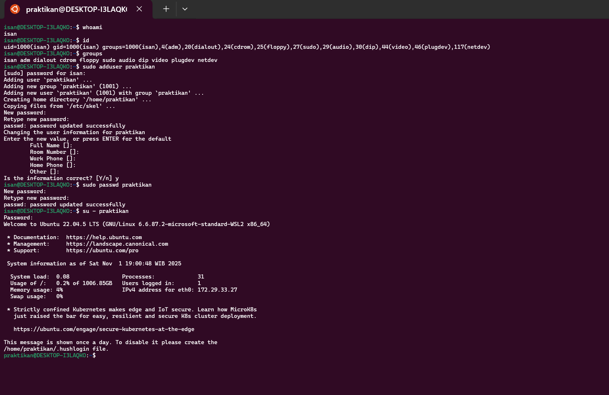
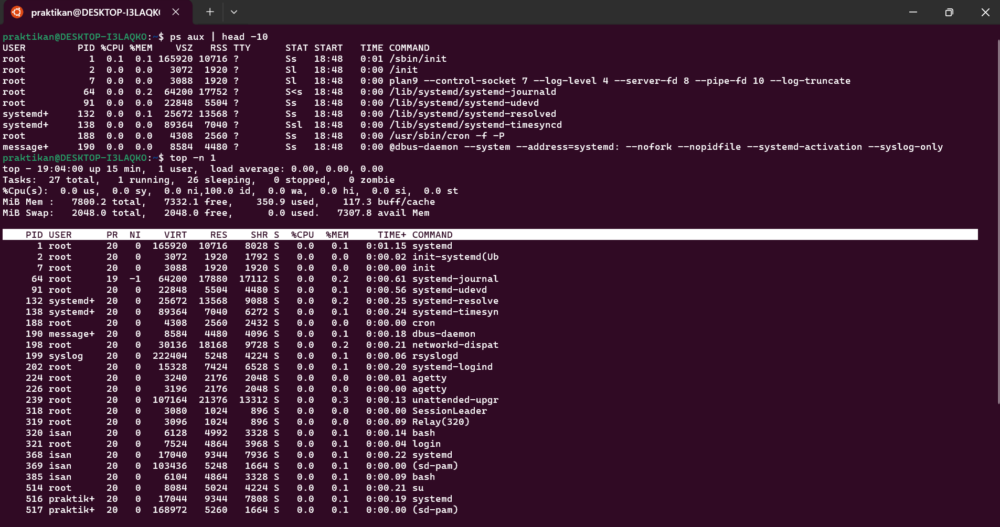
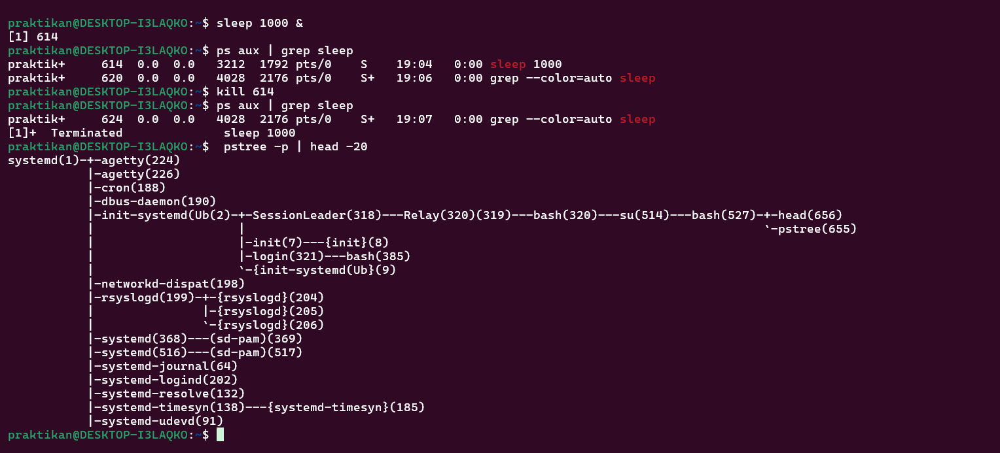

# Laporan Praktikum Minggu [4]
Topik: Manajemen Proses dan User di Linux
---

## Identitas
- **Nama**  : Ikhsan Mu'arif
- **NIM**   : 250202921 
- **Kelas** : 1IKRB

---

## Tujuan
Setelah menyelesaikan tugas ini, mahasiswa mampu:
1. Menjelaskan konsep proses dan user dalam sistem operasi Linux.  
2. Menampilkan daftar proses yang sedang berjalan dan statusnya.  
3. Menggunakan perintah untuk membuat dan mengelola user.  
4. Menghentikan atau mengontrol proses tertentu menggunakan PID.  
5. Menjelaskan kaitan antara manajemen user dan keamanan sistem.  

---

## Dasar Teori
Dalam sistem operasi multi-user seperti Linux, manajemen proses dan manajemen user adalah dua konsep fundamental.

Proses adalah sebuah program yang sedang dieksekusi. Setiap kali Anda menjalankan perintah atau aplikasi, sistem operasi akan membuat satu atau lebih proses. Setiap proses memiliki ID unik yang disebut Process ID (PID), informasi mengenai pengguna yang menjalankannya , serta sumber daya yang digunakannya . Proses induk parent process dapat membuat proses turunan child process, membentuk sebuah hierarki yang diawali oleh proses init atau systemd .

Manajemen User adalah cara sistem operasi mengelola siapa saja yang boleh mengakses sistem dan apa saja yang boleh mereka lakukan. Setiap pengguna memiliki User ID (UID) dan tergabung dalam satu atau lebih Group (GID).

---

## Langkah Praktikum
1. **Setup Environment**
   - Gunakan Linux (Ubuntu/WSL).  
   - Pastikan Anda sudah login sebagai user non-root.  
   - Siapkan folder kerja:
     ```
     praktikum/week4-proses-user/
     ```

2. **Eksperimen 1 – Identitas User**
   Jalankan perintah berikut:
   ```bash
   whoami
   id
   groups
   ```
   - Jelaskan setiap output dan fungsinya.  
   - Buat user baru (jika memiliki izin sudo):
     ```bash
     sudo adduser praktikan
     sudo passwd praktikan
     ```
   - Uji login ke user baru.

3. **Eksperimen 2 – Monitoring Proses**
   Jalankan:
   ```bash
   ps aux | head -10
   top -n 1
   ```
   - Jelaskan kolom penting seperti PID, USER, %CPU, %MEM, COMMAND.  
   - Simpan tangkapan layar `top` ke:
     ```
     praktikum/week4-proses-user/screenshots/top.png
     ```

4. **Eksperimen 3 – Kontrol Proses**
   - Jalankan program latar belakang:
     ```bash
     sleep 1000 &
     ps aux | grep sleep
     ```
   - Catat PID proses `sleep`.  
   - Hentikan proses:
     ```bash
     kill <PID>
     ```
   - Pastikan proses telah berhenti dengan `ps aux | grep sleep`.

5. **Eksperimen 4 – Analisis Hierarki Proses**
   Jalankan:
   ```bash
   pstree -p | head -20
   ```
   - Amati hierarki proses dan identifikasi proses induk (`init`/`systemd`).  
   - Catat hasilnya dalam laporan.

6. **Commit & Push**
   ```bash
   git add .
   git commit -m "Minggu 4 - Manajemen Proses & User"
   git push origin main
   ```
---

## Kode / Perintah
Tuliskan potongan kode atau perintah utama:
```bash
whoami
id
groups
sudo adduser praktikan
sudo passwd praktikan
ps aux | head -10
top -n 1
sleep 1000 &
ps aux | grep sleep
kill <PID>
pstree -p | head -20

```

---

## Hasil Eksekusi
## Eksperimen 1

| perintah | hasi output | keterangan |
|----------|-------------|------------|
| whoami | isan | menampilkan nama pengguna yang sedang login saat ini
id|uid=1000(isan) gid=1000(isan) groups=1000(isan),27(sudo),29(audio)|Menampilkan UID (User ID), GID (Group ID), dan semua grup yang diikuti oleh pengguna
|groups|isan adm sudo audio video|Menampilkan daftar grup yang diikuti oleh pengguna
## Eksperimen 2


| Kolom     | Nama Lengkap     | Penjelasan                                                                 |
|-----------|------------------|----------------------------------------------------------------------------|
| **PID**   | Process ID        | Nomor unik yang diberikan sistem untuk mengidentifikasi setiap proses.    |
| **USER**  | User              | Nama pengguna yang menjalankan proses tersebut.                            |
| **%CPU**  | CPU Usage (%)     | Persentase penggunaan CPU oleh proses tersebut. Semakin tinggi, semakin berat prosesnya. |
| **%MEM**  | Memory Usage (%)  | Persentase penggunaan RAM oleh proses tersebut.                            |
| **COMMAND** | Command Line    | Perintah atau program yang dijalankan oleh proses tersebut.                |
## Eksperimen 3 & 4

- systemd(1) adalah proses induk utama yang mengatur semua proses di sistem.
- Struktur pohon menunjukkan bagaimana proses saling terkait secara hierarkis.
- Proses seperti bash, login, dan rsyslogd adalah turunan dari systemd.
---

## Analisis
- Jelaskan makna hasil percobaan.  
  Eksperimen ini menunjukkan bagaimana Linux mengelola identitas pengguna dan proses sistem. Pengguna dapat dikenali melalui UID, GID, dan grup yang menentukan hak akses. Proses sistem dapat dimonitor, dikendalikan, dan dianalisis melalui perintah seperti ps, top, kill, dan pstree. Dengan memahami struktur proses dan hak akses pengguna, kita dapat mengelola sistem secara efisien dan aman.

- Hubungkan hasil dengan teori (fungsi kernel, system call, arsitektur OS).  
  Hasil eksperimen menunjukkan bahwa sistem operasi Linux mengelola identitas pengguna dan proses melalui interaksi antara user space dan kernel. Ketika perintah dijalankan, seperti ps, top, atau kill, sistem menggunakan system call untuk meminta layanan dari kernel, yang bertanggung jawab atas pengelolaan memori, proses, dan perangkat. Struktur proses yang ditampilkan dengan pstree mmemberikan arsitektur sistem operasi yang hierarkis, di mana proses induk seperti systemd menginisialisasi dan mengatur proses lainnya.

- Apa perbedaan hasil di lingkungan OS berbeda (Linux vs Windows)?  
  Di Linux, manajemen user dan proses dilakukan melalui perintah berbasis teks yang langsung berinteraksi dengan kernel melalui system call dan Struktur proses ditampilkan secara hierarkis.
---

## Kesimpulan
Tuliskan 2–3 poin kesimpulan dari praktikum ini.
- Hierarki proses menunjukkan struktur sistem yang dikendalikan oleh systemd sebagai proses induk
- Proses sistem dapat dimonitor, dikendalikan, dan dianalisis melalui perintah seperti ps, top, kill, dan pstree. 
- Eksperimen ini menunjukkan bagaimana Linux mengelola identitas pengguna dan proses sistem.


---

## Quiz
1. Apa fungsi dari proses `init` atau `systemd` dalam sistem Linux?  
   proses init atau systemd adalah proses pertama (PID 1) setelah booting yang berfungsi untuk Memulai sistem dan layanan dasar, Menjadi parent dari semua proses dan mengelola proses, Mengatur shutdown/reboot dengan aman.
2. Apa perbedaan antara `kill` dan `killall`?  
   perbedaan antara kill dan lillall yaitu kill Menghentikan proses berdasarkan PID dan hanya menargetkan proses tertentu. sedangkan killall Menghentikan proses berdasarkan nama dan Bisa mematikan semua proses dengan nama yang sama sekaligus.
3. Mengapa user `root` memiliki hak istimewa di sistem Linux?
   User root di Linux adalah akun administrator dengan hak penuh, yang memungkinkan pengelolaan seluruh sistem, akses ke semua file dan proses, instalasi perangkat lunak, pengaturan konfigurasi, serta kontrol terhadap akun user lain.

---

## Refleksi Diri
Tuliskan secara singkat:
- Apa bagian yang paling menantang minggu ini?  
  semuanya menantang
- Bagaimana cara Anda mengatasinya?  
  dengan belajar mandiri

---

**Credit:**  
_Template laporan praktikum Sistem Operasi (SO-202501) – Universitas Putra Bangsa_
